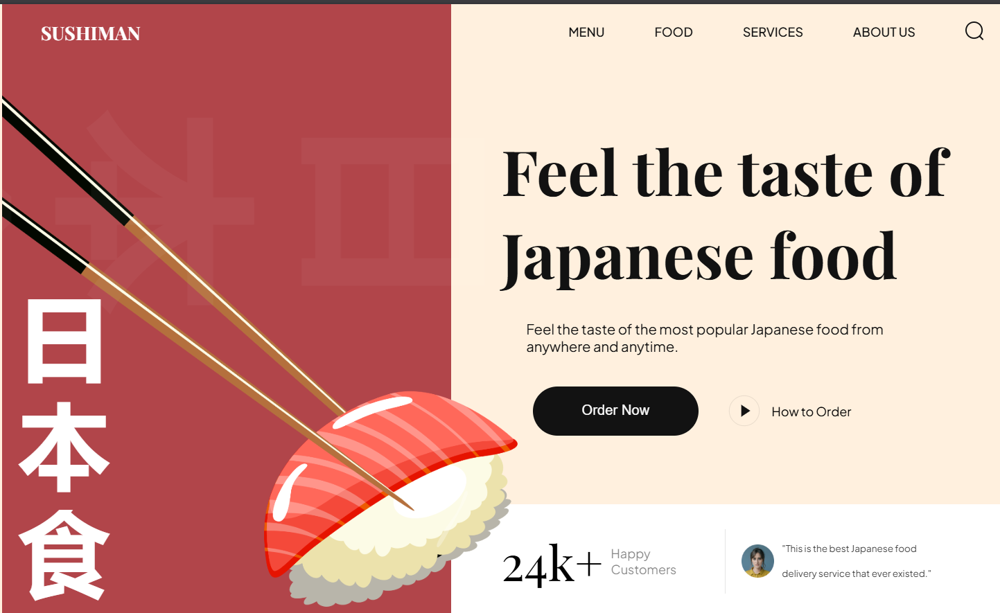
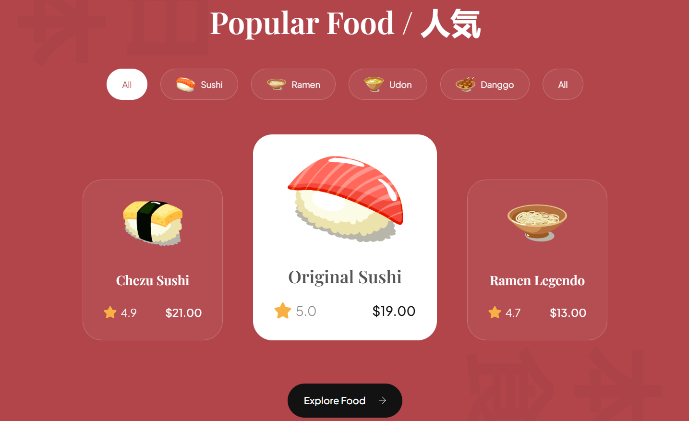

# 🍣 Sushi Delight - Sushi Menu Website

Welcome to **Sushi Delight**, a modern and responsive sushi menu website created using only **HTML** and **CSS**. This project presents a clean, elegant, and mobile-friendly digital menu for sushi restaurants, perfect for showcasing dishes in an aesthetic and functional way.

---

## 📌 Table of Contents

- [Features](#-features)
- [Screenshots](#-screenshots)
- [Tech Stack](#-tech-stack)
- [Getting Started](#-getting-started)
- [Folder Structure](#-folder-structure)
- [Future Enhancements](#-future-enhancements)
- [Acknowledgements](#-acknowledgements)

---

## 🌟 Features

- 🍽️ Restaurant-style menu layout
- 🎨 Beautiful UI with a Japanese-inspired design
- 📱 Fully responsive for all devices
- ⚡ Fast-loading with minimal dependencies
- 🧾 Categorized menu sections (Nigiri, Maki, Sashimi, Drinks, etc.)
- 🖼️ Image gallery-style item display

---

## 📸 Screenshots


*Responsive homepage with hero banner and menu navigation.*


*Stylish and structured menu with categories.*

---

## 🛠 Tech Stack

- **HTML5** – Semantic, accessible markup
- **CSS3** – Responsive design using Flexbox & Grid

---

## 🧑‍💻 Getting Started

To run this project locally:

1. Clone the repository:
   ```bash
   git clone https://github.com/your-github-username/sushi-menu-website.git


2. Navigate into the project directory:

   ```bash
   cd sushi-menu-website
   ```

3. Open `index.html` with your preferred browser:

   * Right-click `index.html` > Open With > Browser
   * Or use Live Server extension in VS Code

---

## 📁 Folder Structure

```
sushi-menu-website/
│
├── index.html
├── style.css
└── assets
```

---

## 🔮 Future Enhancements

* 🌐 Add multi-language support (English, Japanese)
* 🛒 Integrate an order/cart system with JavaScript
* 💬 Add a contact form or chatbot
* 📦 Connect to a backend to update menu items dynamically

---

## 🙏 Acknowledgements

* Inspired by traditional Japanese cuisine and minimal UI design.

---

## 🧑 Author

Kushaagra Singh
[GitHub](https://github.com/maskedgojo) 

---

## 📄 License

This project is open source and available under the [MIT License](LICENSE).

---

Made with ❤️ and 🍣.
